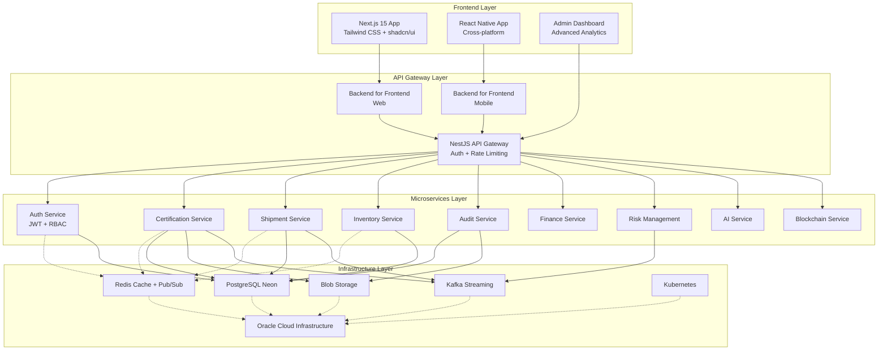
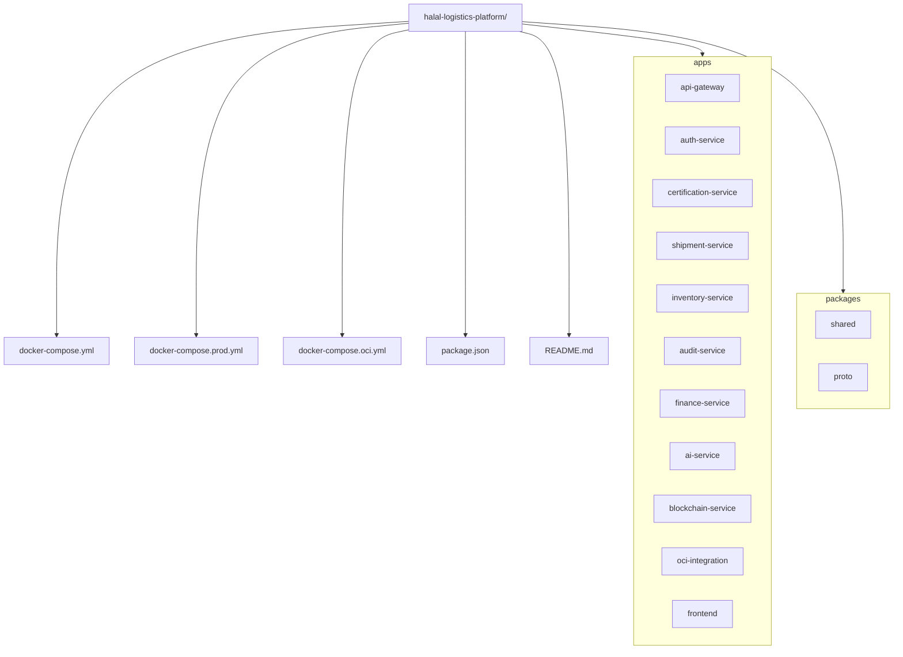

# Halal Logistics and Supply Chain Platform


A **comprehensive microservices-based platform** for managing Halal logistics operations, including certification workflows, shipment tracking, inventory management, compliance auditing, and cross-border trade facilitation.

---

## ✨ Key Features

- **Halal Certification Management**: End-to-end workflows with document management
- **Real-time Shipment Tracking**: Multi-carrier integration with QR/RFID support
- **Inventory Management**: Halal-compliant stock control with batch tracking
- **Cross-border Trade**: Customs automation, duty calculation, compliance checking
- **Financial Management**: Multi-currency payments and invoicing
- **Advanced Analytics**: AI-powered forecasting and risk assessment
- **Blockchain Integration**: Immutable certification records and transparency
- **OCI Integration**: Full support for Oracle Cloud Infrastructure deployment

---

## 🏗 System Architecture



---

## 🗂 Project Structure



---

## 🚀 Quick Start

### Prerequisites


- Node.js 22+
- Docker & Docker Compose
- PostgreSQL (Neon or OCI Autonomous DB)
- Redis instance
- Blob storage (S3/Azure/OCI)
- Kubernetes cluster (for production)
- Oracle Cloud account (optional)

### Setup

```bash
# Clone
git clone https://github.com/your-org/halal-logistics-platform.git
cd halal-logistics-platform

# Copy environment templates
cp .env.example .env
cp apps/auth-service/.env.example apps/auth-service/.env
...

# Start all services
docker-compose up -d

# Run migrations
docker-compose exec auth-service npm run db:migrate
...
```

### Access


- Frontend → [http://localhost:3000](http://localhost:3000)
- API Gateway → [http://localhost:3000/api](http://localhost:3000/api)
- API Docs (Swagger) → [http://localhost:3000/api/docs](http://localhost:3000/api/docs)
- Admin Dashboard → [http://localhost:3000/admin](http://localhost:3000/admin)

---

## 📦 Tech Stack


- **Frontend**: Next.js 15, React 19, Tailwind, shadcn/ui
- **Backend**: NestJS, Node.js 22
- **Database**: PostgreSQL (Neon/OCI Autonomous)
- **ORM**: Prisma
- **Caching**: Redis
- **Messaging**: Kafka, Redis Pub/Sub
- **Storage**: S3/Azure/OCI Object Storage
- **Blockchain**: Ethereum/Hyperledger
- **AI/ML**: TensorFlow\.js
- **Infra**: Docker, Kubernetes, OCI

---

## 🤝 Contributing


We welcome contributions! Please see our [Contributing Guidelines](CONTRIBUTING.md).

1. Fork the repo
2. Create feature branch
3. Commit & push
4. Open a PR

Special call for **OCI integration contributors** 🚀

---

## 📜 License


This project is licensed under the **MIT License**.

---

## 📞 Support


For support and questions:

- Open an issue on GitHub
- Email: [support@halallogistics.xyz](mailto:support@halallogistics.xyz)
- Documentation: docs.halallogistics.com
- Discord: Join our community
- Twitter: @halallogistics_halalchain
- OCI Forum: Oracle Cloud Infrastructure Forum

---

Built with ❤️ for the Halal logistics industry


**Halal Certified • Quality • Compliance • Transparency • OCI Ready**
