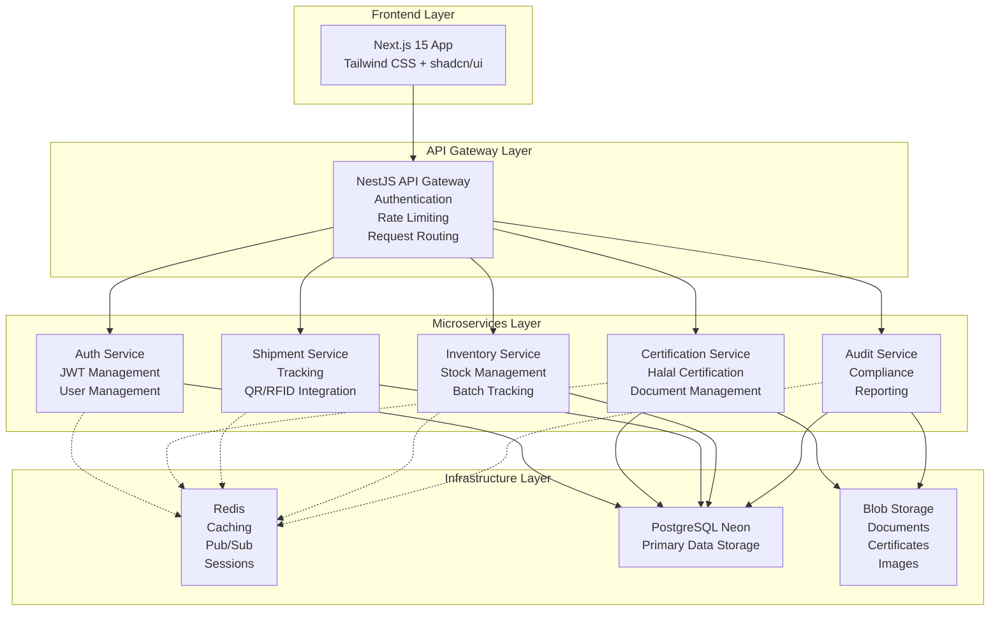

# Halal Logistics and Supply Chain Platform


A comprehensive microservices-based platform for managing Halal logistics operations, including certification workflows, shipment tracking, inventory management, and compliance auditing.

## 🏗️ System Architecture



## 📋 Tech Stack


- **Frontend**: Next.js 15 (App Router), React 19, TypeScript
- **Backend**: NestJS Microservices, Node.js 22
- **API Gateway**: NestJS with Express adapter
- **Database**: PostgreSQL with Neon serverless
- **ORM**: Prisma for type-safe database access
- **Caching & Pub/Sub**: Redis
- **File Storage**: Blob Storage (AWS S3/Azure Blob Storage)
- **Authentication**: JWT with role-based access control
- **UI Framework**: Tailwind CSS + shadcn/ui components
- **Containerization**: Docker with Docker Compose
- **Message Broker**: Redis Pub/Sub for inter-service communication

## 🚀 Quick Start

### Prerequisites


- Node.js 22+
- Docker and Docker Compose
- PostgreSQL database (Neon recommended)
- Redis instance
- Blob Storage account (AWS S3/Azure Blob Storage, or similar)

### 1. Clone the Repository

```bash
git clone https://github.com/your-org/halal-logistics-platform.git
cd halal-logistics-platform
```

### 2. Environment Setup

Copy the environment template files:

```bash
# Copy environment templates
cp .env.example .env
cp apps/auth-service/.env.example apps/auth-service/.env
cp apps/certification-service/.env.example apps/certification-service/.env
cp apps/shipment-service/.env.example apps/shipment-service/.env
cp apps/inventory-service/.env.example apps/inventory-service/.env
cp apps/audit-service/.env.example apps/audit-service/.env
cp apps/api-gateway/.env.example apps/api-gateway/.env
cp apps/frontend/.env.example apps/frontend/.env.local
```

Update each environment file with your specific configuration.

### 3. Start with Docker Compose

```bash
# Start all services
docker-compose up -d

# Or build and start
docker-compose up --build -d

# View logs
docker-compose logs -f
```

### 4. Database Migrations

```bash
# Run migrations for all services
docker-compose exec auth-service npm run db:migrate
docker-compose exec certification-service npm run db:migrate
docker-compose exec shipment-service npm run db:migrate
docker-compose exec inventory-service npm run db:migrate
docker-compose exec audit-service npm run db:migrate

# Seed initial data (optional)
docker-compose exec auth-service npm run db:seed
```

### 5. Access the Application


- **Frontend**: http://localhost:3000
- **API Gateway**: http://localhost:3000/api
- **API Documentation**: http://localhost:3000/api/docs

## 📁 Project Structure

```
halal-logistics-platform/
├── apps/
│   ├── api-gateway/                 # API Gateway (NestJS)
│   ├── auth-service/                # Authentication Service
│   ├── certification-service/       # Certification Management
│   ├── shipment-service/            # Shipment Tracking
│   ├── inventory-service/           # Inventory Management
│   ├── audit-service/               # Audit & Compliance
│   └── frontend/                    # Next.js 15 Frontend
├── packages/
│   ├── shared/                      # Shared utilities and types
│   └── proto/                       # gRPC protocol definitions
├── docker-compose.yml               # Docker compose configuration
├── package.json                     # Root package.json
└── README.md                        # Project documentation
```

## 🔐 Authentication & Authorization

### User Roles


- **ADMIN**: Full system access and user management
- **CERTIFIER**: Manage certifications and conduct audits
- **PROVIDER**: Handle shipments and logistics operations
- **MANUFACTURER**: Submit certifications and manage inventory
- **AUDITOR**: Conduct compliance audits and generate reports

### JWT Token Structure

```typescript
interface JwtPayload {
  userId: string;
  email: string;
  roles: UserRole[];
  permissions: string[];
  services: {
    auth: boolean;
    certification: boolean;
    shipment: boolean;
    inventory: boolean;
    audit: boolean;
  };
  iat: number;
  exp: number;
}
```

## 📊 API Endpoints

### Authentication Service
- `POST /auth/register` - User registration
- `POST /auth/login` - User login
- `POST /auth/refresh` - Refresh access token
- `GET /auth/profile` - Get user profile
- `POST /auth/roles` - Assign roles (Admin only)

### Certification Service
- `POST /certifications` - Submit certification request
- `GET /certifications` - List certifications
- `GET /certifications/:id` - Get certification details
- `PATCH /certifications/:id` - Update certification status
- `POST /certifications/:id/documents` - Upload documents

### Shipment Service
- `POST /shipments` - Create shipment
- `GET /shipments` - List shipments
- `GET /shipments/:id` - Get shipment details
- `GET /shipments/track/:trackingId` - Track shipment
- `POST /shipments/:id/scan` - Record shipment scan

### Inventory Service
- `POST /inventory` - Add inventory item
- `GET /inventory` - List inventory items
- `GET /inventory/:id` - Get inventory item details
- `PATCH /inventory/:id` - Update inventory item
- `POST /inventory/batch` - Create batch

### Audit Service
- `GET /audit` - Get audit logs
- `POST /audit/inspection` - Schedule inspection
- `GET /audit/reports/compliance` - Generate compliance report
- `GET /audit/reports/certifications` - Certification status report

## 🛠️ Development

### Running Services Individually

```bash
# Install dependencies
npm install

# Run all services in development mode
npm run dev

# Or run individual services
npm run dev:auth
npm run dev:certification
npm run dev:shipment
npm run dev:inventory
npm run dev:audit
npm run dev:gateway
npm run dev:frontend
```

### Database Management

```bash
# Generate Prisma client
npx prisma generate

# Create migration
npx prisma migrate dev --name init

# Apply migrations
npx prisma migrate deploy

# Open Prisma Studio
npx prisma studio
```

### Testing


```bash
# Run tests for all services
npm test

# Run tests for specific service
npm run test:auth
npm run test:certification

# Run tests with coverage
npm run test:cov

# Run e2e tests
npm run test:e2e
```

## 🐳 Docker Deployment

### Production Deployment

```bash
# Build production images
docker-compose -f docker-compose.prod.yml build

# Start production services
docker-compose -f docker-compose.prod.yml up -d

# View logs
docker-compose -f docker-compose.prod.yml logs -f
```

### Kubernetes Deployment (Optional)

```bash
# Apply Kubernetes configurations
kubectl apply -f k8s/namespace.yaml
kubectl apply -f k8s/configmaps.yaml
kubectl apply -f k8s/secrets.yaml
kubectl apply -f k8s/deployments.yaml
kubectl apply -f k8s/services.yaml
kubectl apply -f k8s/ingress.yaml
```

## 🔒 Security Features


- JWT authentication with refresh token rotation
- Role-based access control (RBAC)
- Rate limiting with Redis store
- Input validation with class-validator
- SQL injection protection via Prisma
- CORS configuration
- Helmet.js security headers
- CSRF protection
- File upload validation and scanning
- Service-to-service authentication

## 📈 Monitoring & Logging

### Health Checks

```bash
# Check service health
curl http://localhost:3000/api/health

# Check specific service health
curl http://localhost:3000/api/health/auth
curl http://localhost:3000/api/health/certification
```

### Logging

Logs are structured and available through:

- Docker Compose: `docker-compose logs -f`
- Individual containers: `docker logs <container-name>`
- File logs in production environments
- Cloud logging services (when deployed to cloud platforms)

## 🔄 Event-Driven Architecture

### Available Events

```typescript
// User events
USER_CREATED = 'user.created'
USER_UPDATED = 'user.updated'
USER_DELETED = 'user.deleted'

// Certification events
CERTIFICATION_SUBMITTED = 'certification.submitted'
CERTIFICATION_APPROVED = 'certification.approved'
CERTIFICATION_REJECTED = 'certification.rejected'

// Shipment events
SHIPMENT_CREATED = 'shipment.created'
SHIPMENT_UPDATED = 'shipment.updated'
SHIPMENT_SCANNED = 'shipment.scanned'

// Inventory events
INVENTORY_ADDED = 'inventory.added'
INVENTORY_UPDATED = 'inventory.updated'
INVENTORY_LOW = 'inventory.low'

// Audit events
AUDIT_LOG_CREATED = 'audit.log.created'
INSPECTION_SCHEDULED = 'inspection.scheduled'
COMPLIANCE_ISSUE = 'compliance.issue'
```

### Creating Event Listeners

```typescript
@Injectable()
export class UserEventListener {
  constructor(private readonly certificationService: CertificationService) {}

  @OnEvent('user.created')
  async handleUserCreatedEvent(payload: UserCreatedEvent) {
    await this.certificationService.createUserProfile({
      userId: payload.userId,
      email: payload.email,
      role: payload.role
    });
  }
}
```

## 📱 Future Enhancements


- [ ] Mobile app (React Native)
- [ ] Blockchain integration for immutable certification records
- [ ] RFID/IoT sensor data integration for real-time monitoring
- [ ] PDF certificate generation with digital signatures
- [ ] Advanced analytics dashboard with data visualization
- [ ] Multi-language support for international operations
- [ ] WebSocket support for real-time notifications
- [ ] GraphQL API for flexible data querying
- [ ] Machine learning for compliance prediction
- [ ] Supply chain optimization algorithms

## 🤝 Contributing


We welcome contributions! Please see our [Contributing Guidelines](CONTRIBUTING.md) for details.

1. Fork the repository
2. Create a feature branch: `git checkout -b feature/amazing-feature`
3. Commit your changes: `git commit -m 'Add amazing feature'`
4. Push to the branch: `git push origin feature/amazing-feature`
5. Open a pull request

## 📄 License


This project is licensed under the MIT License - see the [LICENSE](LICENSE) file for details.

## 🆘 Support


For support and questions:

- Open an issue on GitHub
- Email: support@halallogistics.com
- Documentation: [docs.halallogistics.com](https://docs.halallogistics.com)

## 🙏 Acknowledgments

- NestJS team for the excellent framework
- Next.js team for the React framework
- Prisma team for the database toolkit
- The open-source community for countless libraries and tools

---

Built with ❤️ for the Halal logistics industry


