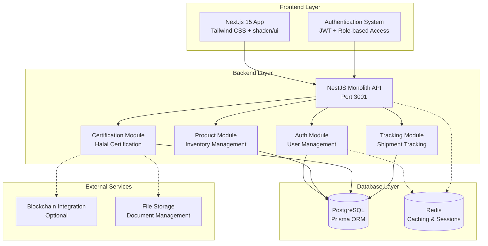
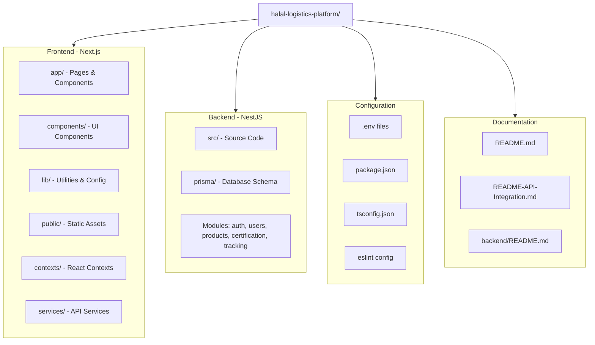

# Halal Logistics and Supply Chain Platform


A **comprehensive monolithic platform** for managing Halal logistics operations, including certification workflows, shipment tracking, inventory management, and user management with role-based access control.

---

## ✨ Key Features

- **Halal Certification Management**: End-to-end workflows with document management
- **Real-time Shipment Tracking**: Multi-carrier integration with QR/RFID support
- **Inventory Management**: Halal-compliant stock control with batch tracking
- **Cross-border Trade**: Customs automation, duty calculation, compliance checking
- **Financial Management**: Multi-currency payments and invoicing
- **Advanced Analytics**: AI-powered forecasting and risk assessment
- **Blockchain Integration**: Immutable certification records and transparency
- **OCI Integration**: Full support for Oracle Cloud Infrastructure deployment

---

## 🏗 System Architecture



---

## 🗂 Project Structure



---

## 🚀 Quick Start

### Prerequisites


- Node.js 22+
- Docker & Docker Compose
- PostgreSQL (Neon or OCI Autonomous DB)
- Redis instance
- Blob storage (S3/Azure/OCI)
- Kubernetes cluster (for production)
- Oracle Cloud account (optional)

### Setup

```bash
# Clone the repository
git clone https://github.com/your-org/halal-logistics-platform.git
cd halal-logistics-platform

# Install frontend dependencies
npm install

# Install backend dependencies
cd backend
npm install
cd ..

# Set up environment variables
cp .env.example .env  # Update with your database URL and other configs

# Set up the database
cd backend
npx prisma generate
npx prisma db push
cd ..

# Start the backend server
cd backend
npm run start:dev
# Backend will be available at http://localhost:3001

# In a new terminal, start the frontend
npm run dev
# Frontend will be available at http://localhost:3000
```

### Access


- Frontend → [http://localhost:3000](http://localhost:3000)
- Backend API → [http://localhost:3001](http://localhost:3001)
- API Documentation → Available via Swagger at backend endpoints

---

## 📦 Tech Stack


- **Frontend**: Next.js 15, React 18, TypeScript, Tailwind CSS, shadcn/ui
- **Backend**: NestJS 10, Node.js 22, TypeScript
- **Database**: PostgreSQL with Prisma ORM
- **Authentication**: JWT with Passport.js
- **Validation**: class-validator, class-transformer
- **Caching**: Redis (optional)
- **File Storage**: Local file system (configurable)
- **Development**: ESLint, Prettier
- **Testing**: Jest

---

## 🤝 Contributing


We welcome contributions! Here's how you can help:

1. Fork the repository
2. Create a feature branch (`git checkout -b feature/amazing-feature`)
3. Make your changes
4. Run tests (`npm test` in backend, `npm run build` in frontend)
5. Commit your changes (`git commit -m 'Add amazing feature'`)
6. Push to the branch (`git push origin feature/amazing-feature`)
7. Open a Pull Request

### Development Guidelines

- Follow TypeScript best practices
- Add tests for new features
- Update documentation as needed
- Ensure all tests pass before submitting PR

---

## 📜 License


This project is licensed under the **MIT License**.

---

## 📞 Support


For support and questions:

- Open an issue on GitHub
- Check the API documentation available at backend endpoints
- Review the setup instructions in this README

---

Built with ❤️ for logistics and supply chain management
