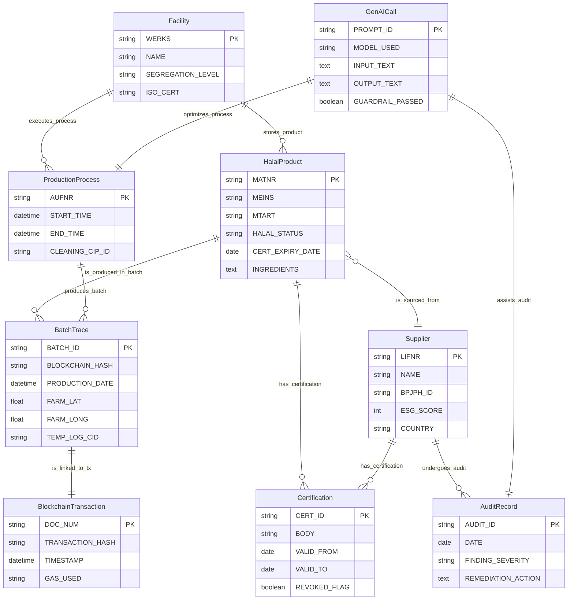

# EHM Agent Query Templates (Example Cypher)

These templates show how each Claude agent can query the Enterprise Halal Management (EHM) knowledge graph.

> Assumes the Neo4j model from `ehm-cypher.cypher`.

---

## 1) Halal Compliance Officer — certificate validity

```cypher
MATCH (p:HalalProduct {MATNR: $MATNR})-[:HAS_CERTIFICATION]->(c:Certification)
WHERE c.VALID_TO >= date()
RETURN
  p.MATNR,
  c.CERT_ID,
  c.BODY,
  c.VALID_FROM,
  c.VALID_TO,
  c.REVOKED_FLAG;
```

If you need to flag expiries within N days:

```cypher
MATCH (p:HalalProduct {MATNR: $MATNR})-[:HAS_CERTIFICATION]->(c:Certification)
WHERE c.VALID_TO <= date() + duration('P30D')
RETURN p.MATNR, c.CERT_ID, c.VALID_TO;
```

---

## 2) Ethical Halal Strategist — ESG + Tayyib sourcing

```cypher
MATCH (s:Supplier)-[:ALIGNED_WITH]->(:Concept {name:'Tayyib'})
WHERE s.ESG_SCORE >= $MIN_ESG
RETURN s.LIFNR, s.NAME, s.COUNTRY, s.ESG_SCORE
ORDER BY s.ESG_SCORE DESC
LIMIT $LIMIT;
```

---

## 3) Halal Tech Innovator — blockchain traceability for a batch

```cypher
MATCH (b:BatchTrace {BATCH_ID: $BATCH_ID})
OPTIONAL MATCH (b)-[:IS_LINKED_TO_TX]->(tx:BlockchainTransaction)
RETURN
  b.BATCH_ID,
  b.BLOCKCHAIN_HASH,
  tx.TRANSACTION_HASH,
  tx.TIMESTAMP,
  tx.GAS_USED;
```

---

## 4) OCI GenAI Bridge — guardrail-passed GenAI logging

```cypher
MATCH (g:GenAICall)
WHERE g.GUARDRAIL_PASSED = true
RETURN g.PROMPT_ID, g.MODEL_USED, g.INPUT_TEXT, g.OUTPUT_TEXT
ORDER BY g.PROMPT_ID DESC
LIMIT $LIMIT;
```

For a specific prompt or batch context:

```cypher
MATCH (g:GenAICall)
WHERE g.INPUT_TEXT CONTAINS $BATCH_ID
RETURN g.PROMPT_ID, g.MODEL_USED, g.GUARDRAIL_PASSED;
```

---

## 5) Supply Chain Manager — full product journey (farm → facility)

```cypher
MATCH (p:HalalProduct {MATNR: $MATNR})
OPTIONAL MATCH (p)-[:IS_SOURCED_FROM]->(s:Supplier)
OPTIONAL MATCH (p)-[:IS_PRODUCED_IN_BATCH]->(b:BatchTrace)
OPTIONAL MATCH (b)<-[:PRODUCES_BATCH]-(o:ProductionProcess)
OPTIONAL MATCH (b)<-[:PRODUCES_BATCH]-(o)-[:EXECUTES_PROCESS]->(f:Facility)
RETURN p, s, b, o, f;
```

---

## 6) Audit Triage — related supplier + audits + GenAI assistance

```cypher
MATCH (s:Supplier {LIFNR: $LIFNR})-[:UNDERGOES_AUDIT]->(a:AuditRecord)
OPTIONAL MATCH (g:GenAICall)-[:ASSISTS_AUDIT]->(a)
RETURN a.AUDIT_ID, a.DATE, a.FINDING_SEVERITY, a.REMEDIATION_ACTION,
       collect({prompt_id: g.PROMPT_ID, model: g.MODEL_USED, guardrail_passed: g.GUARDRAIL_PASSED}) AS genai_calls;
```

---

## 7) Cross-check — “what regulations require compliance for this product?”

```cypher
MATCH (p:HalalProduct {MATNR: $MATNR})-[:REQUIRES_COMPLIANCE]->(r:Regulation)
RETURN r.name AS regulation, r.country, r.mandatory, r.scope;
```


