# Enterprise Halal Management (EHM) Knowledge Graph

This folder contains a complete, self-contained **Enterprise Knowledge Graph** for Halal compliance, ERP-style master data modeling, traceability, audit support, and GenAI logging.

## Contents
- `ehm-meta-model.md` – entities, attributes, relationships (ERP-inspired)
- `ehm-er-diagram.mermaid` – ER diagram in Mermaid `erDiagram` format
- `ehm-cypher.cypher` – Neo4j schema: constraints, indexes, sample data
- `ehm-sample-queries.md` – agent query templates
- `scripts/query-ehm-graph.sh` – hook script that queries the graph before audits

## Quick Start (Neo4j)
1. Import the schema + sample data:
   - Run `ehm-cypher.cypher` in Neo4j Browser/Console.
2. Test a query:
   - `MATCH (p:HalalProduct) RETURN p LIMIT 5;`
3. Run the hook query script:
   - `./scripts/query-ehm-graph.sh BATCH-2026-06-28-001`

## Agent Integration
Each Claude agent can use the graph by running one of the Cypher snippets in:
- `ehm-sample-queries.md`

## Notes
- The scripts use `cypher-shell` if installed.
- Otherwise, they fall back to Neo4j HTTP transactional endpoint using:
  - `NEO4J_URL`, `NEO4J_USER`, `NEO4J_PASS`

```mermaid
graph TD
    %% Concepts
    Halal[("Halal")] -->|is_a| Tayyib[("Tayyib")]
    Tayyib -->|includes| ESG[("ESG")]
    Halal -->|requires| Certification[("Certification")]
    Blockchain[("Blockchain")] -->|provides| Traceability[("Traceability")]
    Traceability -->|enables| HalalProof[("Halal‑Proof")]
    OCI[("OCI GenAI")] -->|supports| SemanticSearch[("Semantic Search")]
    OCI -->|supports| Summarization[("Summarization")]
    OCI -->|supports| Moderation[("Moderation")]

    %% Regulations
    BPJPH[("BPJPH")] -->|mandates| Halal
    JAKIM[("JAKIM")] -->|mandates| Halal
    SMIIC[("SMIIC")] -->|harmonises| Halal

    %% Agents
    HalalComplianceOfficer[("Halal Compliance Officer")] -->|USES| HalalCertSkill[("halal-certification")]
    HalalComplianceOfficer -->|USES| BlockchainSkill[("blockchain-traceability")]
    HalalComplianceOfficer -->|USES| SupplyChainSkill[("supply-chain")]
    HalalComplianceOfficer -->|USES| OCISkill[("oci-genai")]
    HalalComplianceOfficer -->|REFERENCES| Halal
    HalalComplianceOfficer -->|REFERENCES| BPJPH
    HalalComplianceOfficer -->|REFERENCES| JAKIM

    EthicalStrategist[("Ethical Halal Strategist")] -->|USES| SourcingSkill[("sustainable-sourcing")]
    EthicalStrategist -->|USES| InsightsSkill[("consumer-insights")]
    EthicalStrategist -->|USES| BrandingSkill[("ethical-branding")]
    EthicalStrategist -->|REFERENCES| Tayyib
    EthicalStrategist -->|REFERENCES| ESG

    HalalTechInnovator[("Halal Tech Innovator")] -->|USES| AISkill[("ai-implementation")]
    HalalTechInnovator -->|USES| BlockchainSkill
    HalalTechInnovator -->|USES| FintechSkill[("fintech")]
    HalalTechInnovator -->|USES| OCISkill
    HalalTechInnovator -->|REFERENCES| Blockchain
    HalalTechInnovator -->|REFERENCES| OCI

    %% Skills
    HalalCertSkill -->|DEPENDS_ON| BlockchainSkill
    BlockchainSkill -->|PROVIDES| Traceability
    OCISkill -->|PROVIDES| OCI
    SourcingSkill -->|DEPENDS_ON| InsightsSkill

    %% Commands
    AuditCommand[("/audit_halal_supply_chain")] -->|IMPLEMENTS| HalalComplianceOfficer
    AuditCommand -->|USES| HalalCertSkill
    AuditCommand -->|USES| BlockchainSkill
    StrategyCommand[("/develop_halal_digital_strategy")] -->|IMPLEMENTS| EthicalStrategist
    StrategyCommand -->|USES| SourcingSkill
    StrategyCommand -->|USES| InsightsSkill
    EthicsCommand[("/assess_halal_ethics")] -->|IMPLEMENTS| EthicalStrategist
    EthicsCommand -->|USES| SourcingSkill
    OCICommand[("/run_oci_chat")] -->|IMPLEMENTS| HalalTechInnovator
    OCICommand -->|USES| OCISkill

    %% Hooks & Scripts
    PreToolHook[("PreToolUse (Write)")] -->|TRIGGERS| EthicalCheck[("ethical-check.sh")]
    PreToolHook -->|TRIGGERS| ComplianceCheck[("compliance-check.sh")]
    PreToolHook -->|TRIGGERS| SecretsCheck[("check-secrets.sh")]
    PreToolHook -->|TRIGGERS| EnvCheck[("validate-env.sh")]
    PostToolHook[("PostToolUse (Write)")] -->|TRIGGERS| FormatScript[("format-and-lint.sh")]
    PostToolHook -->|TRIGGERS| ReportScript[("generate-halal-report.sh")]

    PreToolHook -->|PRE_TOOL| WriteTool[("Write")]
    PreToolHook -->|PRE_TOOL| EditTool[("Edit")]
    PostToolHook -->|POST_TOOL| WriteTool

    %% External Services
    OCI -->|PROVIDES| OCISkill
    BlockchainNetwork[("Hyperledger Fabric")] -->|PROVIDES| BlockchainSkill
    Ethereum[("Ethereum")] -->|PROVIDES| BlockchainSkill

    %% Additional relationships
    HalalCertSkill -->|REFERENCES| Certification
    BlockchainSkill -->|REFERENCES| Traceability
    OCISkill -->|REFERENCES| Moderation
    EthicalCheck -->|REFERENCES| Tayyib
    ComplianceCheck -->|REFERENCES| BPJPH

    %% Styling
    classDef agent fill:#f9f,stroke:#333,stroke-width:2px;
    classDef skill fill:#bbf,stroke:#333,stroke-width:2px;
    classDef command fill:#bfb,stroke:#333,stroke-width:2px;
    classDef hook fill:#fdb,stroke:#333,stroke-width:2px;
    classDef concept fill:#fcf,stroke:#333,stroke-width:2px;
    classDef external fill:#ddf,stroke:#333,stroke-width:2px;
    classDef regulation fill:#ffb,stroke:#333,stroke-width:2px;
    classDef tool fill:#ddd,stroke:#333,stroke-width:2px;

    class HalalComplianceOfficer,EthicalStrategist,HalalTechInnovator agent;
    class HalalCertSkill,BlockchainSkill,SupplyChainSkill,OCISkill,SourcingSkill,InsightsSkill,BrandingSkill,AISkill,FintechSkill skill;
    class AuditCommand,StrategyCommand,EthicsCommand,OCICommand command;
    class PreToolHook,PostToolHook hook;
    class Halal,Tayyib,ESG,Certification,Blockchain,Traceability,HalalProof,SemanticSearch,Summarization,Moderation concept;
    class OCI,BlockchainNetwork,Ethereum external;
    class BPJPH,JAKIM,SMIIC regulation;
    class WriteTool,EditTool tool;
```

