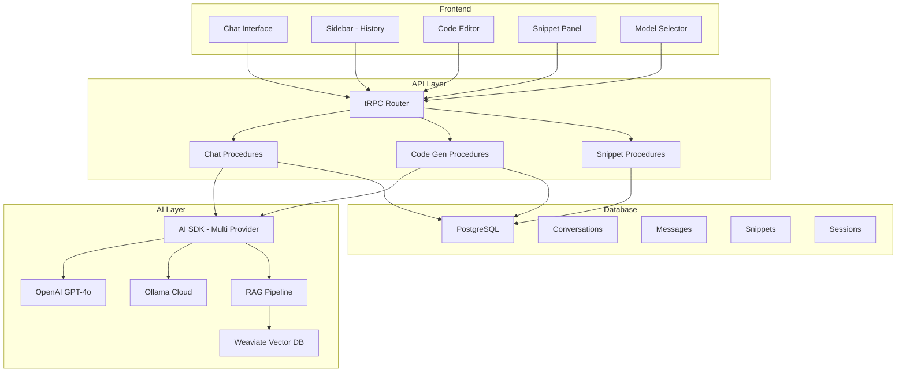
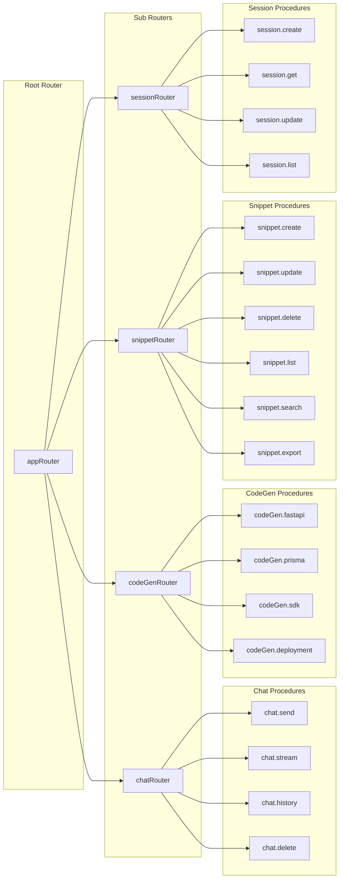
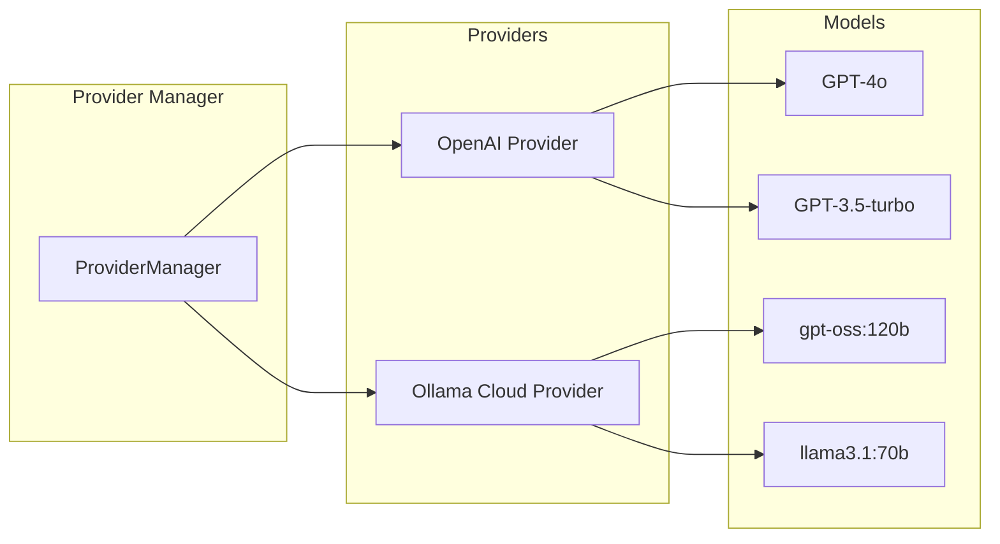
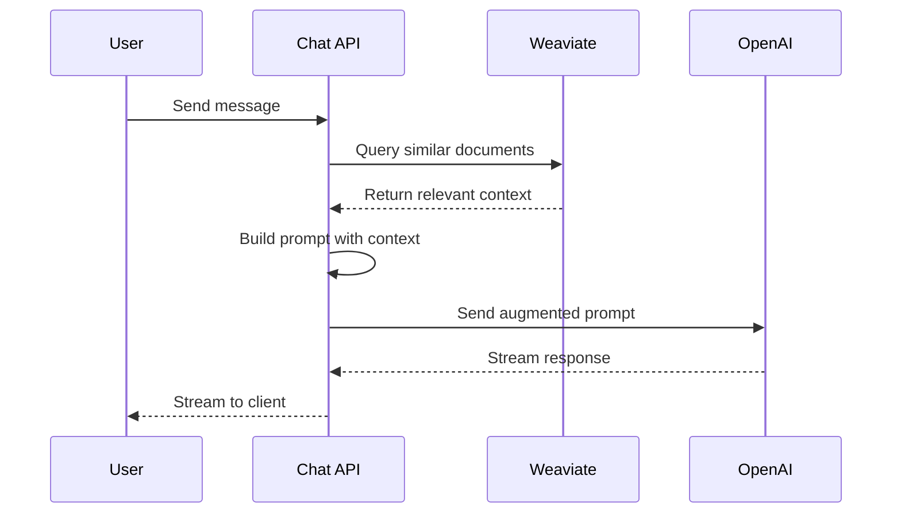
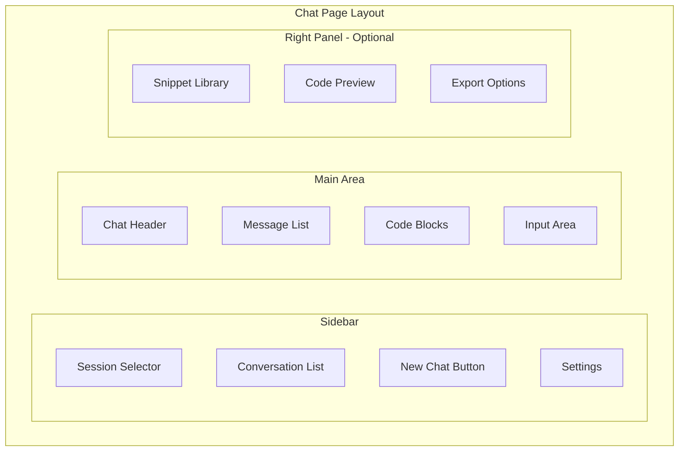

# HalalChain AI Developer Assistant - Technical Implementation Plan

## Executive Summary

This document outlines the technical implementation plan for adding an AI-powered developer assistant to the Halal-Logistics application. The assistant will help users generate code, APIs, and schemas for halal logistics applications, with light domain context for better code generation.

**Key Technologies:**
- **AI SDK**: Vercel AI SDK with multi-provider support (OpenAI + Ollama Cloud)
- **API Layer**: tRPC migration from existing Next.js API routes
- **Vector Database**: Weaviate for RAG-based knowledge retrieval
- **Database**: PostgreSQL with Prisma ORM for conversation/session storage
- **UI Framework**: shadcn/ui with ai-elements for chat interface

---

## Architecture Overview



---

## Phase 1: Setup and Infrastructure

### 1.1 Dependencies Installation

**New packages to install:**

```bash
# AI SDK with multi-provider support
npm install ai @ai-sdk/openai ollama

# tRPC for Next.js
npm install @trpc/server @trpc/client @trpc/react-query @trpc/next
npm install @tanstack/react-query

# Weaviate client
npm install weaviate-ts-client

# Additional utilities
npm install nanoid zod-to-json-schema
npm install react-markdown remark-gfm rehype-highlight
npm install @uiw/react-codemirror @codemirror/lang-typescript @codemirror/lang-python
```

### 1.2 Database Schema Updates

**New Prisma models to add:**

```prisma
// prisma/schema.prisma

model Conversation {
  id          String    @id @default(cuid())
  title       String?
  userId      String
  sessionId   String?
  createdAt   DateTime  @default(now())
  updatedAt   DateTime  @updatedAt
  isArchived  Boolean   @default(false)
  
  messages    Message[]
  snippets    CodeSnippet[]
  session     Session?  @relation(fields: [sessionId], references: [id])
  
  @@index([userId])
  @@index([sessionId])
}

model Message {
  id             String       @id @default(cuid())
  conversationId String
  role           MessageRole
  content        String       @db.Text
  metadata       Json?
  createdAt      DateTime     @default(now())
  
  conversation   Conversation @relation(fields: [conversationId], references: [id], onDelete: Cascade)
  
  @@index([conversationId])
}

enum MessageRole {
  user
  assistant
  system
}

model CodeSnippet {
  id             String        @id @default(cuid())
  title          String
  description    String?
  code           String        @db.Text
  language       String
  tags           String[]
  conversationId String?
  userId         String
  isPublic       Boolean       @default(false)
  createdAt      DateTime      @default(now())
  updatedAt      DateTime      @updatedAt
  
  conversation   Conversation? @relation(fields: [conversationId], references: [id])
  versions       SnippetVersion[]
  
  @@index([userId])
  @@index([conversationId])
  @@index([language])
}

model SnippetVersion {
  id         String      @id @default(cuid())
  snippetId  String
  code       String      @db.Text
  version    Int
  changelog  String?
  createdAt  DateTime    @default(now())
  
  snippet    CodeSnippet @relation(fields: [snippetId], references: [id], onDelete: Cascade)
  
  @@index([snippetId])
  @@unique([snippetId, version])
}

model Session {
  id            String         @id @default(cuid())
  name          String
  description   String?
  userId        String
  context       Json?          // Stores development phase, project type, etc.
  isActive      Boolean        @default(true)
  createdAt     DateTime       @default(now())
  updatedAt     DateTime       @updatedAt
  
  conversations Conversation[]
  
  @@index([userId])
}
```

### 1.3 Database Helpers

**Create helper functions for database operations:**

```
lib/
  db/
    conversations.ts   # CRUD for conversations
    messages.ts        # CRUD for messages
    snippets.ts        # CRUD for code snippets
    sessions.ts        # CRUD for sessions
    index.ts           # Export all helpers
```

### 1.4 Environment Variables

**Required environment variables:**

```env
# OpenAI (Primary Provider)
OPENAI_API_KEY=sk-...

# Ollama Cloud (Secondary Provider)
OLLAMA_API_KEY=your_ollama_api_key
OLLAMA_HOST=https://ollama.com

# Provider Selection (openai | ollama)
DEFAULT_LLM_PROVIDER=openai

# Weaviate
WEAVIATE_URL=http://localhost:8080
WEAVIATE_API_KEY=...

# Database (existing)
DATABASE_URL=postgresql://...
```

---

## Phase 2: tRPC Migration

### 2.1 tRPC Setup Structure

```
server/
  trpc/
    trpc.ts           # tRPC initialization
    context.ts        # Request context with auth
    routers/
      index.ts        # Root router
      chat.ts         # Chat procedures
      codeGen.ts      # Code generation procedures
      snippets.ts     # Snippet management
      sessions.ts     # Session management
```

### 2.2 tRPC Router Architecture



### 2.3 Key tRPC Procedures

**Chat Router:**
- `chat.send` - Send message and get AI response
- `chat.stream` - Stream AI response for real-time display
- `chat.history` - Get conversation history
- `chat.conversations.list` - List all conversations
- `chat.conversations.create` - Create new conversation
- `chat.conversations.delete` - Delete conversation

**Code Generation Router:**
- `codeGen.fastapi` - Generate FastAPI endpoints
- `codeGen.prisma` - Generate Prisma schemas
- `codeGen.weaviate` - Generate Weaviate models
- `codeGen.sdk` - Generate client SDK code
- `codeGen.deployment` - Generate deployment configs

**Snippet Router:**
- `snippet.create` - Save code snippet
- `snippet.update` - Update snippet with version history
- `snippet.delete` - Delete snippet
- `snippet.list` - List user snippets with filters
- `snippet.search` - Full-text search snippets
- `snippet.export` - Export snippets as files

---

## Phase 3: AI SDK Integration

### 3.1 Multi-Provider Configuration

The system supports multiple LLM providers for flexibility, cost optimization, and redundancy.

#### Provider Architecture



#### Provider Implementation

```typescript
// lib/ai/providers/index.ts
import { createOpenAI } from '@ai-sdk/openai';
import { Ollama } from 'ollama';

export type ProviderType = 'openai' | 'ollama';

// OpenAI Provider
export const openaiProvider = createOpenAI({
  apiKey: process.env.OPENAI_API_KEY,
});

// Ollama Cloud Provider
export const ollamaProvider = new Ollama({
  host: process.env.OLLAMA_HOST || 'https://ollama.com',
  headers: {
    Authorization: `Bearer ${process.env.OLLAMA_API_KEY}`,
  },
});

// Model configurations
export const models = {
  openai: {
    primary: openaiProvider('gpt-4o'),
    fast: openaiProvider('gpt-3.5-turbo'),
    embedding: openaiProvider('text-embedding-3-small'),
  },
  ollama: {
    primary: 'gpt-oss:120b',
    fast: 'llama3.1:8b',
    code: 'codellama:34b',
  },
};

// Provider selection based on environment or user preference
export function getProvider(type?: ProviderType) {
  const providerType = type || process.env.DEFAULT_LLM_PROVIDER as ProviderType || 'openai';
  return providerType === 'ollama' ? ollamaProvider : openaiProvider;
}

export function getModel(type?: ProviderType, tier: 'primary' | 'fast' = 'primary') {
  const providerType = type || process.env.DEFAULT_LLM_PROVIDER as ProviderType || 'openai';
  return models[providerType][tier];
}
```

#### Ollama Cloud Integration

```typescript
// lib/ai/providers/ollama-client.ts
import { Ollama } from 'ollama';

const ollama = new Ollama({
  host: process.env.OLLAMA_HOST || 'https://ollama.com',
  headers: {
    Authorization: `Bearer ${process.env.OLLAMA_API_KEY}`,
  },
});

export async function streamOllamaChat(
  model: string,
  messages: Array<{ role: string; content: string }>,
  onToken: (token: string) => void
) {
  const response = await ollama.chat({
    model,
    messages,
    stream: true,
  });

  for await (const part of response) {
    onToken(part.message.content);
  }
}

export async function ollamaChat(
  model: string,
  messages: Array<{ role: string; content: string }>
) {
  const response = await ollama.chat({
    model,
    messages,
    stream: false,
  });

  return response.message.content;
}
```

#### Provider Selection Strategy

| Use Case | Recommended Provider | Model |
|----------|---------------------|-------|
| Complex code generation | OpenAI | GPT-4o |
| Quick responses | Ollama Cloud | llama3.1:8b |
| Large context tasks | Ollama Cloud | gpt-oss:120b |
| Cost-sensitive operations | Ollama Cloud | Any |
| Embeddings for RAG | OpenAI | text-embedding-3-small |

#### Fallback Configuration

```typescript
// lib/ai/providers/fallback.ts
export async function chatWithFallback(
  messages: Array<{ role: string; content: string }>,
  options: { preferredProvider?: ProviderType } = {}
) {
  const providers: ProviderType[] = options.preferredProvider
    ? [options.preferredProvider, options.preferredProvider === 'openai' ? 'ollama' : 'openai']
    : ['openai', 'ollama'];

  for (const provider of providers) {
    try {
      if (provider === 'openai') {
        return await openaiChat(messages);
      } else {
        return await ollamaChat('gpt-oss:120b', messages);
      }
    } catch (error) {
      console.error(`Provider ${provider} failed, trying fallback...`);
      continue;
    }
  }
  
  throw new Error('All providers failed');
}
```

### 3.2 System Prompts

**HalalChain Developer Assistant Prompt:**

```typescript
// lib/ai/prompts.ts
export const HALALCHAIN_SYSTEM_PROMPT = `You are HalalChain, an expert developer assistant specializing in building halal logistics and supply chain applications.

## Your Expertise:
- Full-stack web development (Next.js, React, TypeScript)
- Backend development (FastAPI, Node.js, Python)
- Database design (PostgreSQL, Prisma ORM)
- Vector databases (Weaviate) for RAG applications
- API design (REST, tRPC, gRPC)
- Blockchain integration (Hyperledger Fabric)
- DevOps and deployment configurations

## Domain Context:
You understand halal logistics concepts including:
- Halal certification workflows
- Supply chain tracking and traceability
- Compliance monitoring
- Product categorization (Meat, Dairy, Processed Foods, etc.)

## Response Guidelines:
1. Generate clean, production-ready code
2. Include TypeScript types where applicable
3. Follow best practices for the target framework
4. Add helpful comments explaining complex logic
5. Consider security and error handling
6. Provide multiple implementation options when relevant

## Code Style:
- Use modern ES6+ syntax
- Prefer functional components in React
- Use async/await over callbacks
- Include proper error handling
- Add JSDoc comments for functions
`;
```

### 3.3 RAG Pipeline with Weaviate



### 3.4 Knowledge Base Structure

**Weaviate schema for knowledge base:**

```typescript
// lib/ai/weaviate-schema.ts
export const knowledgeBaseSchema = {
  class: 'HalalChainKnowledge',
  description: 'Knowledge base for HalalChain developer assistant',
  vectorizer: 'text2vec-openai',
  moduleConfig: {
    'text2vec-openai': {
      model: 'text-embedding-3-small',
      type: 'text',
    },
  },
  properties: [
    {
      name: 'content',
      dataType: ['text'],
      description: 'The main content',
    },
    {
      name: 'category',
      dataType: ['string'],
      description: 'Category: code-example, documentation, pattern, template',
    },
    {
      name: 'language',
      dataType: ['string'],
      description: 'Programming language if applicable',
    },
    {
      name: 'framework',
      dataType: ['string'],
      description: 'Framework: nextjs, fastapi, prisma, etc.',
    },
    {
      name: 'tags',
      dataType: ['string[]'],
      description: 'Relevant tags',
    },
  ],
};
```

---

## Phase 4: UI Components

### 4.1 Chat Interface Layout



### 4.2 Component Structure

```
components/
  chat/
    ChatInterface.tsx       # Main chat container
    ChatSidebar.tsx         # Conversation history sidebar
    MessageList.tsx         # Scrollable message list
    MessageItem.tsx         # Individual message display
    ChatInput.tsx           # Message input with code support
    StreamingIndicator.tsx  # Loading/streaming state
    CodeBlock.tsx           # Syntax-highlighted code blocks
    CopyButton.tsx          # Copy code to clipboard
    ModelSelector.tsx       # LLM provider/model selection
    
  snippets/
    SnippetLibrary.tsx      # Snippet management panel
    SnippetCard.tsx         # Individual snippet display
    SnippetEditor.tsx       # Edit/create snippets
    SnippetSearch.tsx       # Search and filter snippets
    VersionHistory.tsx      # Snippet version history
    
  sessions/
    SessionSelector.tsx     # Session dropdown/picker
    SessionSettings.tsx     # Configure session context
```

### 4.3 Model Selector Component

The Model Selector allows users to choose between available LLM providers:

```typescript
// components/chat/ModelSelector.tsx
interface ModelOption {
  provider: 'openai' | 'ollama';
  model: string;
  label: string;
  description: string;
  tier: 'premium' | 'standard' | 'fast';
}

const modelOptions: ModelOption[] = [
  {
    provider: 'openai',
    model: 'gpt-4o',
    label: 'GPT-4o',
    description: 'Most capable, best for complex code',
    tier: 'premium',
  },
  {
    provider: 'ollama',
    model: 'gpt-oss:120b',
    label: 'GPT-OSS 120B',
    description: 'Large model via Ollama Cloud',
    tier: 'standard',
  },
  {
    provider: 'openai',
    model: 'gpt-3.5-turbo',
    label: 'GPT-3.5 Turbo',
    description: 'Fast responses, good for simple tasks',
    tier: 'fast',
  },
  {
    provider: 'ollama',
    model: 'llama3.1:8b',
    label: 'Llama 3.1 8B',
    description: 'Fastest, cost-effective',
    tier: 'fast',
  },
];
```

### 4.3 Key UI Features

1. **Markdown Rendering** - Full markdown support with GFM
2. **Syntax Highlighting** - Code blocks with language detection
3. **Copy to Clipboard** - One-click code copying
4. **Streaming Display** - Real-time token streaming
5. **Code Editor** - Inline editing with CodeMirror
6. **Snippet Saving** - Save generated code to library
7. **Export Options** - Download snippets as files

---

## Phase 5: Code Generation Features

### 5.1 FastAPI Generator

**Input:** Entity name, fields, relationships
**Output:** Complete FastAPI router with CRUD operations

```python
# Example generated output
from fastapi import APIRouter, Depends, HTTPException
from sqlalchemy.orm import Session
from typing import List
from app.models import Product
from app.schemas import ProductCreate, ProductUpdate, ProductResponse
from app.database import get_db

router = APIRouter(prefix="/products", tags=["products"])

@router.get("/", response_model=List[ProductResponse])
async def list_products(
    skip: int = 0,
    limit: int = 100,
    db: Session = Depends(get_db)
):
    products = db.query(Product).offset(skip).limit(limit).all()
    return products
# ... more endpoints
```

### 5.2 Prisma Schema Generator

**Input:** Entity definition with types
**Output:** Prisma model with relations

### 5.3 Weaviate Model Generator

**Input:** Data structure for vectorization
**Output:** Weaviate class schema

### 5.4 SDK Generator

**Input:** API specification
**Output:** TypeScript client library

### 5.5 Deployment Config Generator

**Input:** Project type, infrastructure needs
**Output:** Docker, Kubernetes, or Vercel configs

---

## Phase 6: Session and Snippet Management

### 6.1 Session Context

Sessions store development context:
- Project type (web app, API, mobile)
- Tech stack preferences
- Current development phase
- Custom instructions

### 6.2 Snippet Features

- **CRUD Operations** - Full management
- **Version History** - Track changes over time
- **Tagging** - Organize by tags
- **Search** - Full-text search
- **Export** - Download as files
- **Share** - Public snippets optional

---

## Phase 7: Advanced Features

### 7.1 Integration Documentation

Provide guidance for integrating:
- **gRPC** - Service-to-service communication
- **TensorFlow.js** - ML model inference in browser
- **Weaviate** - Vector search and RAG
- **BullMQ** - Job queues and background processing

### 7.2 Context-Aware Guidance

Adapt responses based on:
- Current development phase
- Previous conversation context
- User preferences
- Project requirements

---

## Phase 8: Production Deployment

### 8.1 Infrastructure Requirements

| Component | Production Recommendation |
|-----------|--------------------------|
| Database | Neon PostgreSQL / Supabase |
| Vector DB | Weaviate Cloud |
| LLM Primary | OpenAI API |
| LLM Secondary | Ollama Cloud |
| Hosting | Vercel / Railway |
| CDN | Vercel Edge |
| Monitoring | Vercel Analytics + Sentry |

### 8.2 Environment Configuration

```env
# Production Environment
NODE_ENV=production

# LLM Providers
OPENAI_API_KEY=sk-prod-...
OLLAMA_API_KEY=prod-ollama-key
OLLAMA_HOST=https://ollama.com
DEFAULT_LLM_PROVIDER=openai

# Vector Database
WEAVIATE_URL=https://your-cluster.weaviate.cloud
WEAVIATE_API_KEY=prod-key

# Database
DATABASE_URL=postgresql://prod-connection
```

### 8.3 Deployment Checklist

- [ ] Optimize Next.js build
- [ ] Configure production environment variables
- [ ] Set up custom domain
- [ ] Enable SSL/TLS
- [ ] Configure database backups
- [ ] Set up monitoring and logging
- [ ] Deploy to production
- [ ] Verify all features
- [ ] Set up CI/CD pipelines

---

## Implementation Roadmap

### Week 1-2: Foundation
- [ ] Install dependencies
- [ ] Update Prisma schema
- [ ] Run migrations
- [ ] Create database helpers
- [ ] Set up tRPC

### Week 3-4: AI Integration
- [ ] Configure AI SDK with OpenAI
- [ ] Configure Ollama Cloud as secondary provider
- [ ] Implement provider fallback mechanism
- [ ] Create system prompts
- [ ] Set up Weaviate
- [ ] Implement RAG pipeline
- [ ] Build streaming chat endpoint

### Week 5-6: UI Development
- [ ] Build chat interface
- [ ] Implement message rendering
- [ ] Add code block components
- [ ] Create sidebar navigation
- [ ] Add snippet management UI

### Week 7-8: Code Generation
- [ ] FastAPI generator
- [ ] Prisma generator
- [ ] Weaviate model generator
- [ ] SDK generator
- [ ] Deployment config generator

### Week 9-10: Polish and Deploy
- [ ] Error handling
- [ ] Performance optimization
- [ ] Testing
- [ ] Documentation
- [ ] Production deployment

---

## File Structure Summary

```
Halal-Logistics/
├── app/
│   ├── api/
│   │   └── trpc/
│   │       └── [trpc]/
│   │           └── route.ts
│   └── chat/
│       └── page.tsx
├── components/
│   ├── chat/
│   │   ├── ChatInterface.tsx
│   │   ├── ChatSidebar.tsx
│   │   ├── MessageList.tsx
│   │   ├── MessageItem.tsx
│   │   ├── ChatInput.tsx
│   │   ├── StreamingIndicator.tsx
│   │   ├── CodeBlock.tsx
│   │   └── ModelSelector.tsx      # LLM provider/model selection
│   └── snippets/
│       ├── SnippetLibrary.tsx
│       ├── SnippetCard.tsx
│       └── SnippetEditor.tsx
├── lib/
│   ├── ai/
│   │   ├── providers/
│   │   │   ├── index.ts           # Provider exports
│   │   │   ├── openai-client.ts   # OpenAI integration
│   │   │   ├── ollama-client.ts   # Ollama Cloud integration
│   │   │   └── fallback.ts        # Fallback mechanism
│   │   ├── prompts.ts
│   │   ├── rag.ts
│   │   └── weaviate-schema.ts
│   └── db/
│       ├── conversations.ts
│       ├── messages.ts
│       ├── snippets.ts
│       └── sessions.ts
├── server/
│   └── trpc/
│       ├── trpc.ts
│       ├── context.ts
│       └── routers/
│           ├── index.ts
│           ├── chat.ts
│           ├── codeGen.ts
│           ├── snippets.ts
│           └── sessions.ts
└── prisma/
    └── schema.prisma
```

---

## Risk Assessment

| Risk | Impact | Mitigation |
|------|--------|------------|
| OpenAI API costs | High | Use Ollama Cloud for cost-sensitive tasks, implement rate limiting |
| Single provider dependency | High | Multi-provider support with automatic fallback |
| Weaviate complexity | Medium | Start with simple schema, iterate |
| tRPC migration scope | Medium | Incremental migration, keep old routes |
| Streaming reliability | Low | Implement retry logic, provider fallbacks |
| Code generation quality | Medium | Extensive prompt engineering, examples |
| Ollama Cloud availability | Low | Fallback to OpenAI when Ollama is unavailable |

### Multi-Provider Benefits

1. **Cost Optimization** - Route simple queries to Ollama Cloud, complex tasks to OpenAI
2. **Redundancy** - Automatic failover if one provider is down
3. **Flexibility** - Users can choose provider based on needs
4. **Future-Proofing** - Easy to add new providers as they become available

---

## Success Metrics

1. **Response Time** - Chat responses begin streaming within 2 seconds
2. **Code Quality** - Generated code passes linting without errors
3. **User Engagement** - Users save 3+ snippets per session on average
4. **Uptime** - 99.9% availability for chat functionality
5. **Context Relevance** - RAG retrieval improves response quality measurably

---

## Conclusion

This plan provides a comprehensive roadmap for implementing the HalalChain AI Developer Assistant. The architecture leverages modern technologies like Vercel AI SDK, tRPC, and Weaviate to create a powerful, scalable solution for code generation and developer assistance in the halal logistics domain.

The implementation is divided into logical phases that allow for incremental development and testing, with clear deliverables at each stage.
